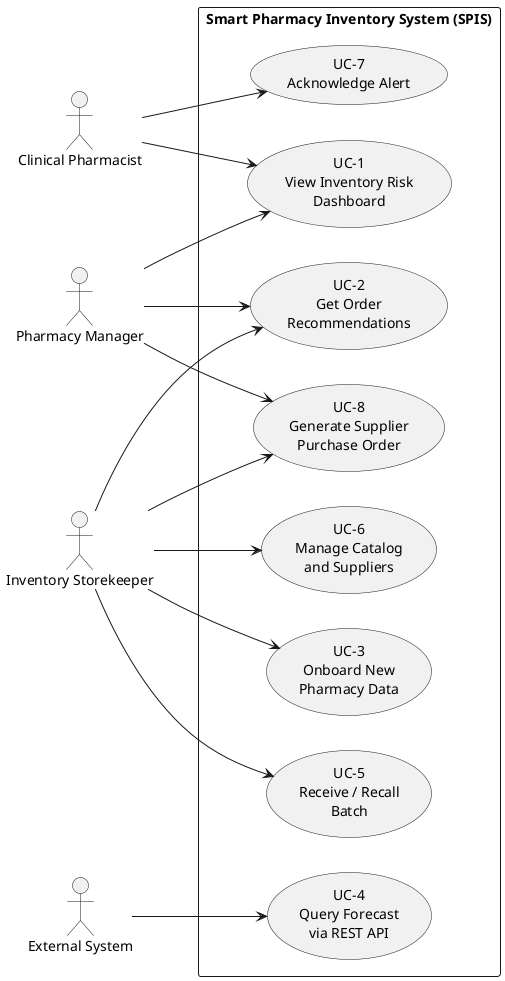
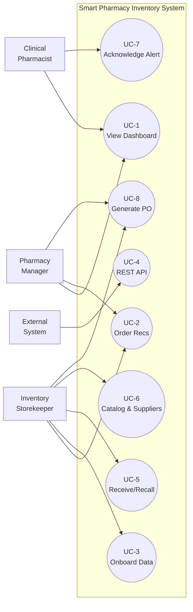

# Ch1-3 Additions for GP2 Submission

_Companion to the GP1 PDF (`M27_GP1.pdf`)._

This document supplies the four small additions the team needs to insert
into Chapters 1-3 for the GP2 final submission. The GP1 PDF stays
authoritative; these are additive patches the team pastes into the GP1
Word source (or types into a fresh document) before compiling the final
PDF. Each addition is marked with an **INSERT AT** pointer.

---

## Addition 1 — Elicitation paragraph

**INSERT AT:** Chapter 3, end of §3.1 Introduction (just before §3.2
"System Overview and Context").

> The requirements documented in this chapter were derived from four
> sources rather than from formal user interviews. First, the project
> advisor's input on the pharmacy-inventory problem domain framed the
> three stakeholder roles (Pharmacy Manager, Clinical Pharmacist,
> Inventory Storekeeper) and the operational constraints around drug
> dispensing and stock control. Second, direct observation of the
> Kaggle Pharma Sales Dataset characteristics — its ATC-4
> classification structure, four-granularity time series (hourly,
> daily, weekly, monthly), and clear calendar dependence — shaped
> the data-management and forecasting FRs. Third, the literature
> reviewed in Chapter 2 (in particular the studies on stockout
> patterns, ABC-VED classification, and demand-forecasting
> shortcomings in small pharmacies) informed the risk-analysis and
> dashboard FRs. Fourth, iterative refinement during Phase 1
> prototyping surfaced practical needs (idempotent ingestion,
> pharmacy-agnostic CSV import, missing-artifact safeguards) that
> entered the non-functional requirements. Formal interviews with
> practising pharmacists were not feasible within the GP1 timebox;
> the resulting requirement set is therefore an analyst-derived
> approximation validated against published practice rather than a
> survey-derived specification.

---

## Addition 2 — Use case diagram

**INSERT AT:** Chapter 3, beginning of §3.5 (or after §3.4 User
Requirements) — accompanies the existing use case descriptions in the
GP1 PDF.

The diagram covers the four GP1 use cases (UC-1 to UC-4) plus four
new use cases introduced by the Phase 9 scope extension (UC-5 to
UC-8) which become functional in the Streamlit dashboard.

### 2A. PlantUML source (recommended — paste into plantuml.com)

Copy the block below into `https://www.plantuml.com/plantuml/uml/` and
export the rendered PNG. Paste the PNG into Word.



### 2B. Mermaid source (alternative — renders on GitHub or mermaid.live)



### 2C. ASCII fallback (if the team prefers to keep it text-based)

```
                  +-------------------------------------+
                  |   Smart Pharmacy Inventory System   |
                  +-------------------------------------+
                  |                                     |
   Pharmacy ----->| ( UC-1 ) View Dashboard             |
   Manager   --+->|                                     |<-- Clinical
              |   | ( UC-2 ) Get Order Recommendations  |    Pharmacist
              |   |                                     |
              +-->| ( UC-8 ) Generate Purchase Order    |
                  |                                     |
                  | ( UC-3 ) Onboard New Pharmacy Data  |<-- Inventory
                  |                                     |    Storekeeper
                  | ( UC-5 ) Receive / Recall Batch     |<--+
                  |                                     |
                  | ( UC-6 ) Manage Catalog & Suppliers |<--+
                  |                                     |
                  | ( UC-7 ) Acknowledge Alert          |<-- Clinical
                  |                                     |    Pharmacist
                  | ( UC-4 ) Query Forecast via API     |<-- External
                  |                                     |    System
                  +-------------------------------------+
```

### 2D. Brief use case descriptions for the new UC-5 to UC-8

The existing GP1 PDF has descriptions for UC-1 to UC-4 already. The
following short descriptions extend the set to match the Phase 9
deliverables.

**UC-5 — Receive or Recall a Batch.** _Actor:_ Inventory Storekeeper.
_Pre:_ database initialised. _Main flow:_ user opens Page 5; fills the
Receive form (ATC code, batch number, quantity, unit cost, expiry
date) and submits; system inserts the row in `inventory_batches`,
increments `atc_inventory.current_stock`, and appends an audit-log
entry. _Alternative — recall:_ user fills the Recall form with the
batch number and a reason; system zeroes the batch quantity, sets
`returned = 1`, decrements aggregate stock, appends a `RECALLED
<timestamp>: <reason>` suffix to the batch notes, and logs the action.
_Post:_ stock totals on the Overview page reflect the change on the
next render.

**UC-6 — Manage Catalog and Suppliers.** _Actor:_ Inventory
Storekeeper. _Pre:_ database initialised. _Main flow:_ user opens
Page 7; uses the Add Drug form to register a new SKU under an existing
ATC code, or the Add ATC Code form to register a new category (with an
in-page warning to ingest sales data and retrain before forecasts
become available), or the Add Supplier form to register a new
distributor (auto-assigned supplier_id, unique name check), or the
Assign ATC-to-Supplier form to re-route purchase orders. _Post:_
`atc_categories`, `drugs`, and `suppliers` updated; Purchase Orders
page on next render groups by the new routing.

**UC-7 — Acknowledge an Alert.** _Actor:_ Clinical Pharmacist.
_Pre:_ at least one open alert exists in the `alerts` table.
_Main flow:_ user opens Page 6; reviews the filtered alert feed
(filters by severity, type, and acknowledged state); clicks the
**Ack** button on an alert; system sets `acknowledged_at` to the
current UTC time. _Post:_ alert disappears from the open feed unless
"Show acknowledged" is toggled; if the underlying condition
re-occurs, `alert_engine.refresh()` is free to insert a fresh alert
on the next dashboard load.

**UC-8 — Generate a Supplier Purchase Order.** _Actor:_ Pharmacy
Manager or Inventory Storekeeper. _Pre:_ model artifacts loaded;
inventory has at least one CRITICAL or LOW item. _Main flow:_ user
opens Page 8; system runs the standard risk assessment, then
`po_generator.build_all_pos()` groups CRITICAL and LOW items by their
assigned supplier; user expands the per-supplier card, reviews line
items and grand total, clicks **Download PDF** to obtain a
`fpdf2`-rendered SAR-denominated PO PDF for the supplier, and clicks
**Mark as Sent** to persist the order to the `purchase_orders` table.
_Post:_ PDF saved locally; Order History on the same page records
the send.

---

## Addition 3 — Ch1 Phase Table / Gantt update

**INSERT AT:** Chapter 1, §1.4 Project Timeline. The GP1 PDF has a
Gantt chart that covers Phases 1-5; the team should either redraw the
Gantt with extra bars for Phase 8.5 and Phase 9, or add a short text
note below the existing chart.

If redrawing is too much work, paste this text note immediately after
Figure 1 in §1.4:

> The Gantt chart above reflects the planned schedule at the start of
> the project. The delivered scope was extended in two further phases.
> **Phase 8.5** (post-GP1) split the dashboard into nine pages, added
> per-batch expiry tracking and the two-factor discount advisor, and
> introduced the pharmacy-agnostic CSV ingestion path. **Phase 9**
> added the notification alert engine, the Saudi supplier directory
> with operator-editable management, supplier-grouped purchase-order
> PDFs in SAR, batch receive-and-recall flows with an append-only
> audit CSV, dashboard-driven catalog management, the six-panel
> Analytics page (model accuracy / feature importance / ABC Pareto /
> seasonal decomposition / YoY growth / rolling trend) and a turnover
> KPI strip, plus a P10-P90 bootstrap prediction band on the
> history/forecast page. By the end of Phase 9 the test suite had
> grown to 182 passing tests across 14 files (well above the 75-test
> floor in NFR-2.1), the XGBoost forecaster reached MAE = 1.06 (below
> the 2.0-unit target in Objective 3), and all eight GP2 objectives
> were met or exceeded.

---

## Addition 4 — Quick numbers update in Ch1 §1.3 (Aim and Objectives)

**INSERT AT:** Chapter 1, §1.3, Objective 7 (Test the system with
data). Optional but worth doing because it converts the original
"75 tests" line into evidence of over-delivery.

Replace the GP1 sentence "We will run SPIS on the sales data and check
if the forecasts and risk labels make sense" with a slightly extended
version:

> We will run SPIS on the sales data and check if the forecasts and
> risk labels make sense. The final delivered test suite contains
> 182 automated unit and integration tests across 14 files, all
> passing; the XGBoost MAE of 1.06 units against a baseline of 4.23
> for the naive (lag-1) forecast and 2.89 for the 7-day moving
> average demonstrates that the system meets and exceeds the
> forecasting-accuracy target stated in Objective 3.

This sentence does double duty as evidence for the Conclusion
chapter's "objectives met" claim.

---

## How to use this file

1. Open `M27_GP1.pdf` (or the Word source that produced it).
2. For each addition above, locate the **INSERT AT** target.
3. Paste the text into the document, applying the same paragraph
   style as the surrounding section.
4. For Addition 2 (use case diagram), pick one of the three formats:
   - **PlantUML** — paste source at plantuml.com/plantuml,
     download PNG, embed in Word as Figure 2.
   - **Mermaid** — paste source at mermaid.live, download SVG/PNG.
   - **ASCII** — paste as monospace text into the Word doc directly.
5. Continue to the GP2 Ch4-7 content in
   `docs/Chapters_4_to_7_Updated.md`.
6. Final references list: see `docs/references_master.md`.
